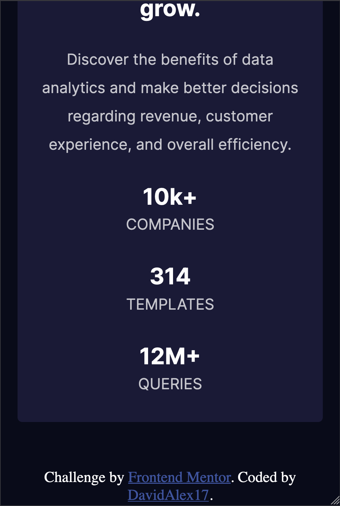

# Frontend Mentor - Stats preview card component solution

This is a solution to the [Stats preview card component challenge on Frontend Mentor](https://www.frontendmentor.io/challenges/stats-preview-card-component-8JqbgoU62). Frontend Mentor challenges help you improve your coding skills by building realistic projects. 

## Table of contents

- [Overview](#overview)
  - [The challenge](#the-challenge)
  - [Screenshot](#screenshot)
  - [Links](#links)
  - [My process](#my-process)
  - [Built with](#built-with)
  - [Continued development](#continued-development)
  - [Author](#author)
  - [Acknowledgments](#acknowledgments)

## Overview

### The challenge

Users should be able to:

- View the optimal layout depending on their device's screen size

### Screenshot

 

### Links

- Solution URL: [Add solution URL here](https://your-solution-url.com)
- Live Site URL: [Add live site URL here](https://your-live-site-url.com)

## My process

I started the challenge by doing mobile first then desktop using media queries. i used sass to file structure everything properly to an extent. 

### Built with

- CSS custom properties
- Flexbox
- Mobile-first workflow
- SASS

### Continued development

For continued development, i believe the area i lack is focusing more on how to properly work with media queries to better preform the responsiveness of the websites i will create. it is a crucial factor in my career to perfect this factor of css. a great opportunity nonetheless. Aside from that, i would like to learn more about sass, although i must admit i am not knowledge in the detail of sass but it is preventing to how to really use sass, if i knew better i would definitely compiled files such as code components for css such as general or parent code even files for media queries. i will work on fixing that as well. to dive more in depth, i believe more code also needs some fixing, such as the specificity of my code and also the sizing elements px, rem, and em.

## Author

- Website - [Stats preview card component](https://davidalex17.github.io/stats-preview-card-component-main/)
- Frontend Mentor - [@DavidAlex17](https://github.com/DavidAlex17)

## Acknowledgments

i want to give credit youtube sources for giving me another perspective on how to code this challenge.
